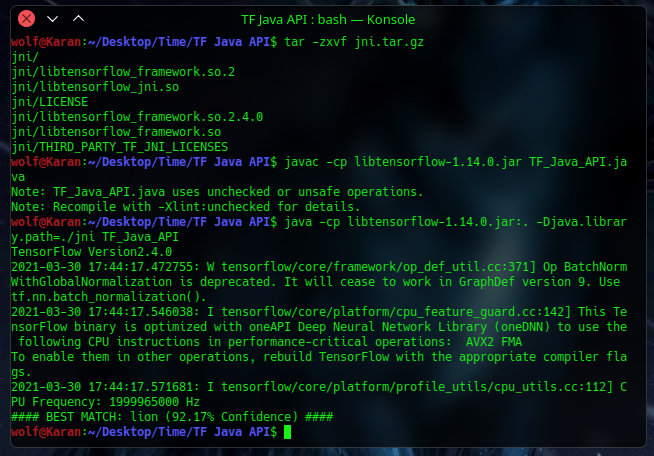

# Tensorflow-Java-Inception-Classifier
Using Tensorflow Java API (legacy) to run the 2015 Inception model graph and create a basic Image Classifier in Java.

This repository is a demo to use pretrained models in Java using Tensorflow bindings

## Installation (Linux):
#### Clone and extract JNI folder
```
git clone https://github.com/wolf-hash/Tensorflow-Java-Inception-Classifier.git
cd Tensorflow-Java-Inception-Classifier
tar -zxvf jni.tar.gz
```
Place any desired image of choice in the images folder and name the as 'test.jpg'.
#### Compile and Run
```
javac -cp libtensorflow-1.14.0.jar TF_Java_API.java 
java -cp libtensorflow-1.14.0.jar:. -Djava.library.path=./jni TF_Java_API
```
#### Output

